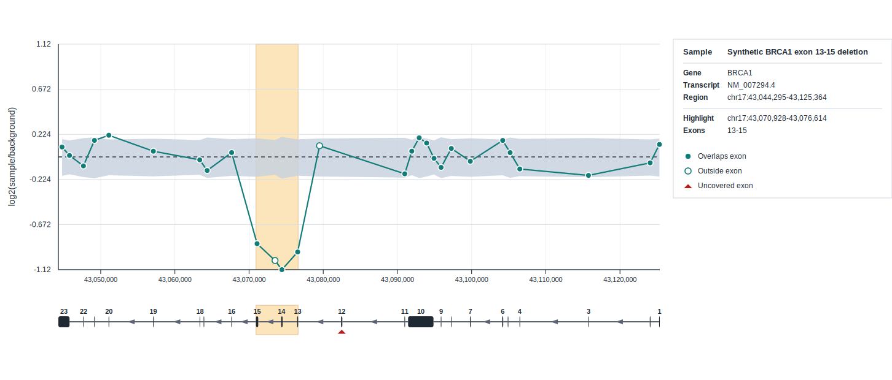

# gcnvplot

[](https://anaconda.org/MOMA-AUH/gcnvplot) [](https://anaconda.org/MOMA-AUH/gcnvplot)

Tool for plotting GATK germline CNV read-count signals against a background cohort

## Installation

The recommended way to install **gcnvplot** is via [conda](https://docs.conda.io/), using the `MOMA-AUH` channel:

```bash
conda install MOMA-AUH::gcnvplot
```

## Usage

```bash
gcnvplot --help
gcnvplot --version
```

## Inputs and output

`gcnvplot` expects GATK `CollectReadCounts` tables as input. These can be plain TSV files or gzipped TSV files, and must contain the columns `CONTIG`, `START`, `END`, and `COUNT`.

For `create-background`, provide a text file with one sample read-count path per line. This command writes a background cohort TSV with interval-wise normalized summary statistics and a per-interval baseline median.

For `plot`, provide one sample read-count file, one background TSV produced by `create-background`, and a genomic region such as `chr1:100-299`. This command writes an SVG plot showing the sample log2 signal relative to the background cohort.

If you want to plot by transcript, first build a SQLite transcript database once with `index-gtf`, then use `--transcript <TRANSCRIPT_ID>` together with `--transcript-db <annotations.sqlite>`. This adds an exon track beneath the signal plot. If you want a custom label in the right-side info panel, pass `--sample-name <LABEL>`.

The plot info panel shows `Sample` when provided, then `Gene`, `Transcript`, and `Region`, followed by a separated `Highlight` and `Exons` section when applicable.

Example:

```bash
gcnvplot create-background \
  --read-counts-list background_inputs.txt \
  --output background.tsv

gcnvplot index-gtf \
  --gtf annotations.gtf.gz \
  --output annotations.sqlite

gcnvplot plot \
  --read-counts sample.tsv \
  --background background.tsv \
  --transcript NM_007294.4 \
  --transcript-db annotations.sqlite \
  --sample-name SAMPLE_01 \
  --output plot.svg
```

## Python API

`gcnvplot` can also be used from Python code, for example when generating reports. Use `TranscriptIndex` to keep the SQLite transcript database open while rendering multiple plots.

Use `render_plot_svg` when you want the SVG as a string, for example for embedding the plot directly into an HTML report or notebook:

```python
from pathlib import Path

import gcnvplot

with gcnvplot.TranscriptIndex(Path("annotations.sqlite")) as transcript_index:
    svg = gcnvplot.render_plot_svg(
        Path("sample.tsv"),
        Path("background.tsv"),
        transcript_id="NM_007294.4",
        transcript_index=transcript_index,
        sample_name="SAMPLE_01",
        highlight="chr17:43070928-43076614",
    )
```


Use `write_plot` when you just want the finished SVG saved to disk. It is a convenience wrapper around `render_plot_svg`.

```python
from pathlib import Path

import gcnvplot

with gcnvplot.TranscriptIndex(Path("annotations.sqlite")) as transcript_index:
    gcnvplot.write_plot(
        Path("sample.tsv"),
        Path("background.tsv"),
        Path("plot.svg"),
        transcript_id="NM_007294.4",
        transcript_index=transcript_index,
        sample_name="SAMPLE_01",
        highlight="chr17:43070928-43076614",
    )
```

## Synthetic example

A tiny synthetic BRCA1 transcript example is available in [`examples/brca1_synthetic`](examples/brca1_synthetic). It demonstrates a highlighted multi-exon deletion, filled and open sample dots, and an uncovered-exon marker.



You can render it directly from the repository root:

```bash
gcnvplot index-gtf \
  --gtf examples/brca1_synthetic/brca1_mane_minimal.gtf \
  --output examples/brca1_synthetic/brca1_mane_minimal.sqlite

gcnvplot plot \
  --read-counts examples/brca1_synthetic/sample_deletion.tsv \
  --background examples/brca1_synthetic/background.tsv \
  --transcript NM_007294.4 \
  --transcript-db examples/brca1_synthetic/brca1_mane_minimal.sqlite \
  --sample-name "Synthetic BRCA1 exon 13-15 deletion" \
  --highlight chr17:43070928-43076614 \
  --output examples/brca1_synthetic/brca1_synthetic.svg
```

This example is designed to show:

- a depressed log2 signal across BRCA1 exons 13-15,
- an intronic interval inside the deletion rendered as an open but still depressed dot,
- an intronic interval outside the deletion rendered as an open near-baseline dot,
- an uncovered exon marked with a triangle in the transcript track.

## Details

The `gcnvplot` tool uses a median-of-ratios normalization. For `create-background`, let `c_ij` be the raw count for interval `i` in background sample `j`.

1. Interval baseline:

   `b_i = median_j(c_ij)` using only positive counts.

2. Background-sample size factor:

   `s_j = median_i(c_ij / b_i)` over intervals with `c_ij > 0` and `b_i > 0`.

3. Normalized background count:

   `n_ij = c_ij / s_j`

The background TSV then stores interval-wise summary statistics across the normalized values `n_ij`, including:

- `BG_NORM_MEAN`
- `BG_NORM_MEDIAN`
- `BG_NORM_SD`
- `BG_NORM_P5`
- `BG_NORM_P95`

For `plot`, let `c_i` be the raw count for the plotted sample at interval `i`.

1. The sample is normalized against the background baselines with the same rule:

   `s = median_i(c_i / b_i)`

   `n_i = c_i / s`

2. The plotted signal is the stabilized log2 ratio against the background median:

   `signal_i = log2((n_i + 0.01) / (m_i + 0.01))`

   where `m_i = BG_NORM_MEDIAN`.

3. The background ribbon is drawn by transforming the stored background percentiles in the same way:

   `lower_i = log2((p5_i + 0.01) / (m_i + 0.01))`

   `upper_i = log2((p95_i + 0.01) / (m_i + 0.01))`

This means the plotted curve shows relative signal after size normalization, while the ribbon shows where the central background cohort typically lies for each interval.
